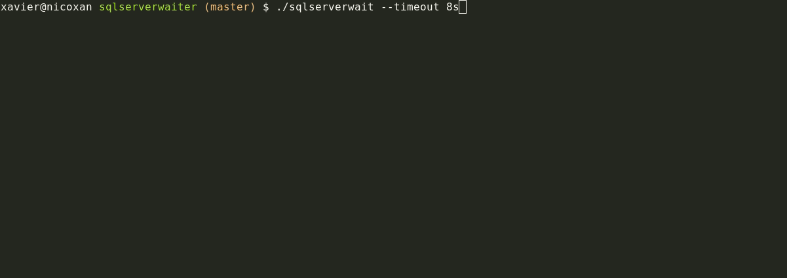
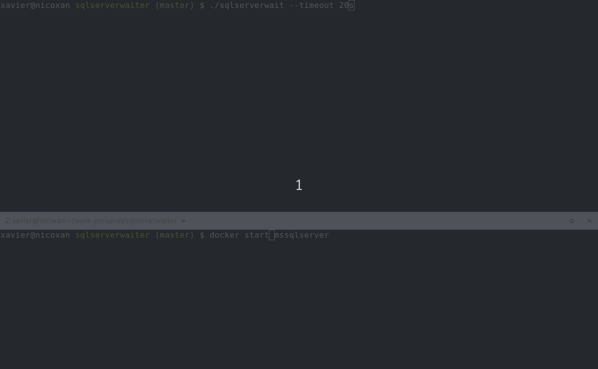

# SQLServer wait

This application waits until a Microsoft SQL Server accepts connections for an specified time. I need it for automatization.

## Options

The flag `-h` provides info about the disponible flags. Running:

```bash
sqlserverwait -h
```

Will show info about the options and default values:

```text
Usage:
  sqlserverwaiter [flags]

Flags:
  -d, --database string    Database name to connect: ex. BikeStores (default "BoIsBo")
      --debug              Show debug info
  -h, --help               help for sqlserverwaiter
      --host string        Database server host (default "localhost")
  -p, --password string    Database user password (default "X1nGuXunG1")
      --port int           Numeric database port (default 1433)
  -t, --timeout duration   Time to wait: 30s, 2m, ... (default 30s)
  -u, --user string        Database user (default "sa")
      --version            version for sqlserverwaiter
```

If no flag is provided default value is taken

## Env vars

Most of the options can be provided with environment vars started with "SQLW\_". Ex. the flag "--password" can be provided with the environment variable `SQLW_PASSWORD`

## Examples

Run the command with SQL Server not started. The app tries to connect with the server until timeout is reached.



When SQL Server is started waits until accepts connections


